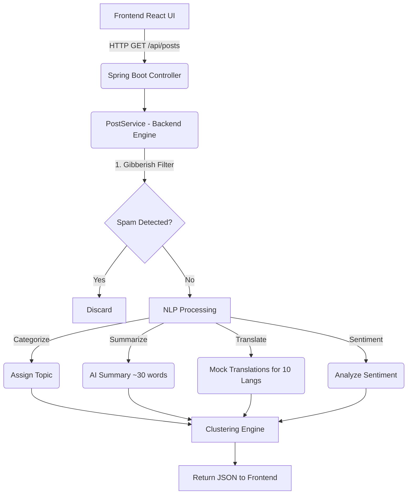

# Social Media Scraper Dashboard

This project is a Full-Stack application designed to aggregate, organize, and analyze social media content related to passports from the last 24 hours.

## Architecture Diagram & Data Flow



## Setup Steps

### 1. Start the Java Spring Boot Backend
1. Open the `backend` folder in **IntelliJ IDEA**.
2. Wait for Maven to resolve dependencies.
3. Run the `DashboardApplication.java` main class.
4. The server will start on `http://localhost:8080`.

### 2. Start the React Frontend
1. Open the `frontend` folder in **VS Code**.
2. Open a terminal inside the `frontend` directory.
3. Run `npm install` to install dependencies.
4. Run `npm run dev` to start the Vite server.
5. Open your browser and go to `http://localhost:5173`.

## Features
- **Real-time scraping mockup**: Simulates data across Twitter, FB, IG, Reddit, LinkedIn, YouTube, TikTok.
- **Multilingual Support**: Supports 10 languages (English, Hindi, Punjabi, Spanish, French, German, Arabic, Chinese, Russian, Japanese).
- **Auto-categorization**: Automatically classifies into Application, Renewal, Appointments, Tatkal, Visa, Travel Issues, Government Announcements, Scams/Fraud, News, Personal Experiences.
- **Gibberish filter**: Built-in backend spam detector.
- **Short AI Summary**: ~30-word summaries attached to each post.
- **Clustered View**: Groups similar topics (e.g., specific processing delays).
- **Filters/Sort**: Advanced filtering by platform, region, sentiment, category, and sorting by engagement or time.
- **Export**: Built-in CSV and PDF export options.

## API Documentation (Postman Alternative)

### `GET /api/posts`

**Description:** Fetches all processed and clustered posts based on optional query parameters.

**Query Parameters:**
- `q` (string): Keyword search
- `platform` (string): e.g., Twitter/X, Reddit
- `category` (string): e.g., Visa, Scams/Fraud
- `region` (string): e.g., India, Global
- `sentiment` (string): Positive, Negative, Neutral
- `sort` (string): `time_new`, `time_old`, `engagement`

**Response Example:**
```json
[
  {
    "id": "1",
    "platform": "Twitter/X",
    "author": "@traveler_joe",
    "content": "Just applied for my passport renewal...",
    "summary": "Just applied for my passport renewal...",
    "category": "Renewal",
    "sentiment": "Neutral",
    "timestamp": "2026-05-26T17:40:57.123Z",
    "likes": 145,
    "shares": 23,
    "region": "India",
    "clusterId": null,
    "translations": {
      "Hindi": "(Translated to Hindi) Just applied for...",
      "Japanese": "(Translated to Japanese) Just applied for..."
    }
  }
]
```
